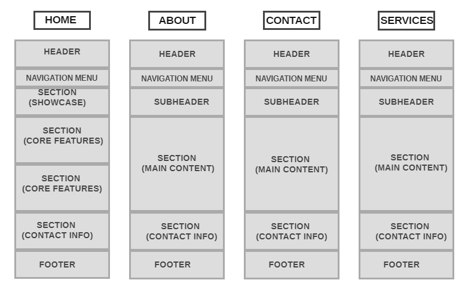

# :black_square_button: Developmental Strategy :black_square_button:

> `App Theme´

In this beginner friendly front-end project we will build a responsive HTML5 and CSS3 website template and we will use FlexboxGrid which is a lightweight Flexbox based grid system

# Wireframe

### 

## 0. Set-Up

**A User can see my initial repository and live demo**

### Repo

- Generate from this [template](https://github.com/HackYourFutureBelgium/w3-validation-template)
- Clone my repository
- Write initial, basic README with VSC
- Push README to Github repo
- Turn on GitHub Pages
- Write Initial Development Strategy
- Create and add wireframe
- Push it to Github repo

## 1. Create `HEADER` and `NAVIGATION MENU`

**full user story description**

### Repo

> I worked on the branch name `Header`

### HTML

- I have added HTML elements for the basic layout:`<header>, <nav>, <section>, <footer>`.
- It was added Flexbox grid `row` `col-xs-12 col-sm-2 col-md-2 col-lg-2`

### CSS

- It was added `-container` for the margin to be auto.

## 2. Create Showcase `section` for the main content

### Repo

> I worked on the SHOWCASE branch

### HTML

- Added `section` with the id "showcase"
- Added Flexbox grid `row`to have 12 columns

### CSS

- No changes made
-

## 3. Create `features` for the main content
